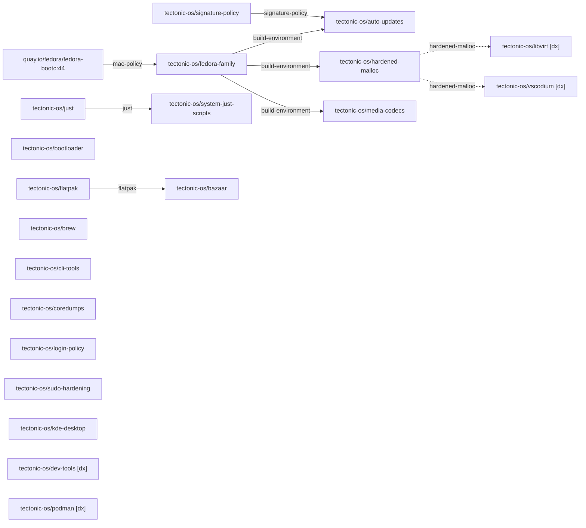

# Desktop capability graph

GENERATED FILE, do not edit.

An arrow points from a provider to what needs it, dotted for `after`,
which orders the build without requiring anything. Layers build left to
right.

## Capabilities

| Name | Kind | Provided by | Required by | After |
|---|---|---|---|---|
| `/etc/pki/containers/cosign.pub` | file | `tectonic-os/signature-policy` |  |  |
| `/usr/libexec/grub2-os-prober-regen` | file | `tectonic-os/bootloader` |  |  |
| `bazaar` | capability | `tectonic-os/bazaar` |  |  |
| `build-environment` | capability | `tectonic-os/fedora-family` | `tectonic-os/auto-updates`, `tectonic-os/hardened-malloc`, `tectonic-os/media-codecs` |  |
| `flatpak` | capability | `tectonic-os/flatpak` | `tectonic-os/bazaar` |  |
| `hardened-malloc` | capability | `tectonic-os/hardened-malloc` |  | `tectonic-os/libvirt`, `tectonic-os/vscodium` |
| `initramfs-generation` | capability | `base` |  |  |
| `just` | capability | `tectonic-os/just` | `tectonic-os/system-just-scripts` |  |
| `mac-policy` | capability | `base` | `tectonic-os/fedora-family` |  |
| `plasma-desktop` | capability | `tectonic-os/kde-desktop` |  |  |
| `rechunking` | capability | `base` |  |  |
| `signature-policy` | capability | `tectonic-os/signature-policy` | `tectonic-os/auto-updates` |  |
